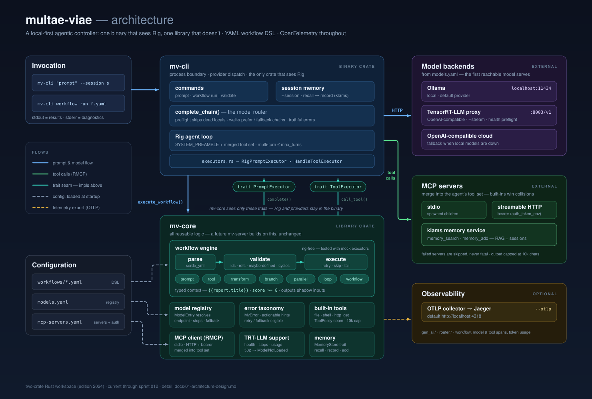

# multae-viae — many paths

> **Archived.** This project is being superseded by a new controller. This
> README will be updated with a pointer once the successor reaches MVP and is
> published to GitHub.

A local-first agentic controller built in Rust that orchestrates multiple LLMs,
tools, and services to act as an always-on AI assistant.



*Detail view of the workflow engine: [docs/assets/architecture-workflow.svg](docs/assets/architecture-workflow.svg)*

## Vision

- **Local-first**: Models run locally via Ollama/TensorRT-LLM/mistral.rs, with cloud fallback
- **Tool-aware**: MCP protocol integration for extensible tool use
- **Multi-model**: Dynamic model routing — right model for each task
- **Observable**: First-class OpenTelemetry telemetry for a companion dashboard
- **Declarative**: YAML-based DSL for workflow/prompt orchestration
- **Extensible**: RAG integration, system monitoring, scheduled tasks

## Research & Design

See the [docs/](docs/) directory for in-depth research and architecture design:

- [Research Overview](docs/00-research-overview.md) — Project vision and key decisions
- [Architecture Design](docs/01-architecture-design.md) — System architecture and data flow
- [Framework Comparison](docs/02-framework-comparison.md) — Rig vs Kalosm vs mistral.rs vs Candle
- [Local Inference](docs/03-local-inference.md) — Ollama, mistral.rs, llama.cpp options
- [MCP Integration](docs/04-mcp-integration.md) — Model Context Protocol and RMCP SDK
- [Telemetry](docs/05-telemetry-observability.md) — OpenTelemetry, tracing, dashboard integration
- [DSL Design](docs/06-dsl-flow-management.md) — YAML-based workflow definition language
- [Model Routing](docs/07-model-routing.md) — Prescriptive, adaptive, and hybrid routing
- [RAG Integration](docs/08-rag-integration.md) — Retrieval-Augmented Generation patterns
- [Roadmap](docs/09-roadmap.md) — Phased implementation plan
- [Investigations](docs/10-investigations.md) — Open questions on tool-use reliability
- [TRT-LLM Integration](docs/11-trt-llm-integration.md) — TensorRT-LLM provider assessment

## Tech Stack

| Layer | Technology |
|-------|-----------|
| Language | Rust |
| Agent Framework | [Rig](https://github.com/0xPlaygrounds/rig) (`rig-core`) |
| Local Inference | [Ollama](https://ollama.com/) + [TensorRT-LLM](https://github.com/NVIDIA/TensorRT-LLM) (`trtllm-serve`); [mistral.rs](https://github.com/EricLBuehler/mistral.rs) planned |
| MCP | [RMCP](https://github.com/modelcontextprotocol/rust-sdk) |
| Telemetry | [OpenTelemetry](https://github.com/open-telemetry/opentelemetry-rust) + `tracing` |

## Quick Start

### Prerequisites

- **Rust** (stable, edition 2024): `rustup update stable`
- **Ollama** running locally: `ollama serve`
- **Model pulled**: `ollama pull qwen3:8b` (the default in the shipped `models.yaml`)
- **just** task runner: `cargo install just`

### Build & Run

```bash
just build                              # Build all crates
just run "What is Rust?"                # Send a prompt
just run "What is Rust?" --json         # JSON output
just run "Hello" -vv 2>debug.log        # Verbose logging
just ci                                 # Format + clippy + test
```

### CLI Usage

```
mv-cli [OPTIONS] <COMMAND>

Commands:
  prompt     Send a prompt to a model (default when no subcommand)
  workflow   Manage and execute workflows

Options (global):
  -v, --verbose    Increase log verbosity (repeat for more: -vv)
      --otlp [URL] Enable OTLP trace export [default: http://localhost:4318]
  -j, --json       Output response as JSON object
  -h, --help       Print help
  -V, --version    Print version

Options (prompt):
  -m, --model <MODEL>        Model name (must exist in config or built-in registry)
  -e, --endpoint <ENDPOINT>  Backend endpoint override (any provider)
  -c, --config <CONFIG>      Path to models.yaml config file
      --mcp-config <PATH>    Path to MCP servers YAML config [default: mcp-servers.yaml]
      --stream               Stream tokens to stdout as they arrive (TRT-LLM models only)
      --no-tools             Disable all tools (built-in and MCP) for this request
```

#### Prompt (default command)

```bash
mv-cli "What is Rust?"                    # Direct prompt
mv-cli prompt "What is Rust?"             # Explicit subcommand
mv-cli -m qwen3:8b "Explain async"        # Specify model
mv-cli --json "Hello"                     # JSON output
mv-cli -m llama-fp8 --stream --no-tools "Explain Rust ownership"  # Stream tokens (TRT-LLM only)
```

**Flag interactions** (`--stream` × `--json` × `--no-tools` × provider):

| Flags | Provider | Behavior |
|-------|----------|----------|
| `--stream` | ollama / openai | Error: `streaming is only supported for TRT-LLM models in this release` |
| `--stream --json` | any | Warning on stderr (`--json overrides --stream`), buffered JSON output |
| `--stream` | trtllm | Note on stderr, falls back to buffered output — tools are attached by default and the TRT-LLM proxy streams tool calls as plain text, so buffered mode (where tool calling works) is used |
| `--stream --no-tools` | trtllm | Streams tokens to stdout as they arrive |
| `--no-tools` (alone) | any | Buffered completion with no tools attached (built-in or MCP) |

> The `just load <id>` hint in TRT-LLM "model not loaded" errors refers to
> the **trt-llm-explore** repo's justfile (which manages the proxy), not
> this repo's.

> Fallback chains apply to buffered completions only. `--stream` keeps
> single-model semantics — there is no mid-stream fallback (tokens already
> shown can't be unshown), so a streamed prompt against a dead model surfaces
> that model's error rather than advancing the chain.

#### Workflows

Define multi-step workflows in YAML and execute them from the CLI:

```bash
# Run a workflow
mv-cli workflow run workflows/examples/research.yaml --input topic="Rust async"

# Validate a workflow file
mv-cli workflow validate workflows/examples/research.yaml

# JSON output
mv-cli --json workflow run workflow.yaml --input topic="AI"
```

Example workflow file (`workflows/examples/research.yaml`):

```yaml
name: research-and-summarize
version: "1.0"
defaults:
  model: qwen3:4b
inputs:
  - name: topic
    type: string
    required: true
steps:
  - id: research
    type: prompt
    output: research_plan
    template: "Create a research plan for: {{topic}}"
  - id: summarize
    type: prompt
    output: summary
    template: "Summarize: {{research_plan}}"
outputs:
  - name: summary
    from: summarize
```

Workflows support seven step types: `prompt` (LLM calls), `tool`, `transform`,
`branch` and `parallel` (sprint 009), and — since sprint 012 — `loop` and
`workflow` (nested). Tool steps execute real tools — the same merged built-in +
MCP tool set the agent sees — with skip/fail/retry error handling (retry
re-attempts transient errors only, and re-runs side effects). `transform`
currently supports a single operation, `extract_json`. Template variables use
`{{var}}` syntax (minijinja); the execution context is **typed** (sprint 012),
so templates do field access (`{{report.title}}`) and conditions compare
numerically (`score >= 8`), with step outputs shadowing workflow inputs.

`branch` runs one of two nested step lists based on a condition; `parallel`
runs its children concurrently against a context snapshot, merging disjoint
outputs at the join; `loop` runs its body do-while up to `max_iterations`,
stopping on a typed `exit_condition`; `workflow` runs another workflow file as
a step (isolated inputs, child outputs returned as one object, cycle/depth
guarded). See the examples in
[`workflows/examples/`](workflows/examples/) and
[docs/06](docs/06-dsl-flow-management.md) for the full semantics (maybe-defined
outputs, typed values, loop and nesting rules).

A prompt step's `model:` may be a single id or a preference list
(`model: { prefer: [qwen3:8b, gpt-4o-mini] }`); the first reachable model
serves, and the substitution shows up in `--json` as `model_used`.

### Model Configuration

Create a `models.yaml` in the project root to configure available models:

```yaml
models:
  - id: qwen3:4b
    provider: ollama
    default: true
  - id: qwen3:8b
    provider: ollama
    # Optional fallback chain: if qwen3:8b is unreachable or its model isn't
    # loaded, try these in order (validated at load — ids must exist, no
    # self-reference). Non-transitive: only this entry's own list is walked.
    # fallback: [qwen3:4b]
  # TRT-LLM provider (start OpenAI proxy from trt-llm-explore first)
  # - id: llama-3_1-8b-fp8
  #   provider: trtllm
  # With metadata and served_name mapping:
  # - id: llama-fp8
  #   provider: trtllm
  #   served_name: meta-llama/Meta-Llama-3.1-8B-Instruct
  #   architecture: llama
  #   quant: fp8
  #   expected_vram_gb: 9
  #   # Optional per-model stop sequences override. When omitted on a
  #   # trtllm entry, multae-viae sends the provider-default set
  #   # ("</s>", "<|im_end|>", "<|eot_id|>") via additional_params.
  #   stop_sequences:
  #     - "<|eot_id|>"
  #     - "<|end_of_text|>"
  # Cloud provider (set OPENAI_API_KEY env var)
  # - id: gpt-4o-mini
  #   provider: openai
  #   api_key_env: OPENAI_API_KEY
```

Without a config file, the CLI uses built-in defaults (qwen3:4b via Ollama).

### OpenTelemetry Traces

To view traces in Jaeger:

```bash
# Start Jaeger (all-in-one)
docker run -d --name jaeger \
  -p 16686:16686 -p 4318:4318 \
  jaegertracing/all-in-one:latest

# Send a prompt with tracing enabled
cargo run -p mv-cli -- --otlp "What is Rust?"

# View traces at http://localhost:16686
```

### Tool Calling

The CLI includes built-in tools that the model can invoke automatically during a
conversation. When a question requires local environment interaction, the agent
calls the appropriate tool, receives the result, and incorporates it into a
natural-language response.

**Available tools:**

| Tool | Description | Example Prompt |
|------|-------------|---------------|
| `file_list` | List directory contents | "What files are in the current directory?" |
| `file_read` | Read a file | "What does README.md say?" |
| `shell_exec` | Run a shell command (30s timeout) | "What git branch am I on?" |
| `http_get` | Fetch a URL via HTTP GET (30s timeout) | "What is the title of https://example.com?" |

Tool calling is transparent — the same CLI invocation works for both tool-using
and non-tool-using queries. Tool output is truncated at 10,000 characters. The
agentic loop runs for up to 10 turns before returning.

```bash
# File tools
cargo run -p mv-cli -- "What files are in the current directory?"
cargo run -p mv-cli -- "What does the README say?"

# Shell execution
cargo run -p mv-cli -- "What git branch am I on?"

# HTTP fetch
cargo run -p mv-cli -- "What is the title of https://example.com?"
```

### MCP Server Configuration

Connect external MCP servers to extend the CLI with additional tools. Create an
`mcp-servers.yaml` in the project root (or specify with `--mcp-config`):

```yaml
servers:
  # Local stdio server (spawns a child process)
  - name: filesystem
    transport: stdio
    command: npx
    args: ["-y", "@modelcontextprotocol/server-filesystem", "/tmp"]
    env:
      NODE_ENV: production

  # Remote HTTP server with bearer auth (e.g. the klams memory service)
  - name: klams
    transport: http
    url: http://kubs0:7777/mcp
    auth_token_env: KLAMS_TOKEN   # env var holding the bearer token (HTTP only)
```

MCP tools merge with built-in tools into a single unified set. The model chooses
the best tool for each task — built-in or MCP — transparently.

**Bearer auth (`auth_token_env`):** for an HTTP server that requires a token,
name the environment variable holding it. The CLI reads the value at connect
time and sends `Authorization: Bearer <token>` on every request — the secret
stays out of config, logs, and traces. A missing variable is an actionable,
non-fatal error (the server is skipped). The field is rejected on `stdio`
servers. This is how the CLI consumes **klams** for retrieval-augmented
context — see [RAG integration](docs/08-rag-integration.md) and the
[`rag-example.yaml`](workflows/examples/rag-example.yaml) workflow.

```bash
# Use with default config file (mcp-servers.yaml)
cargo run -p mv-cli -- "List files in /tmp"

# Use with explicit config path
cargo run -p mv-cli -- --mcp-config path/to/servers.yaml "Search the database"
```

**Behavior:**

- MCP server failures are logged and skipped — the CLI continues with remaining
  servers and built-in tools
- Built-in tools take precedence over MCP tools with the same name
- All MCP connections are shut down gracefully on CLI exit
- MCP tool calls appear in OpenTelemetry traces when `--otlp` is enabled

### Persistent Memory (`--session`)

With a [klams](docs/08-rag-integration.md) memory server configured, `--session`
gives the CLI continuity across invocations: the run recalls prior turns of that
session before answering and records the turn after, so a later run with the
same name remembers it.

```bash
# First run records the turn under session "research"
cargo run -p mv-cli -- --session research "What embedding model does klams use?"

# A later, separate run recalls it
cargo run -p mv-cli -- --session research "And what dimension is that?"
```

- **Opt-in**: without `--session`, nothing is read or written.
- **Agent-writable**: with a `Read|Write` klams token, the model can call
  `memory_add` to remember durable facts/preferences; every write is attributed
  to the run's registered author.
- **Best-effort**: if klams is down, the token is missing, or a write is
  rejected (e.g. klams's backup window), the CLI warns and still answers —
  memory never blocks a prompt.

### REST Server (`mv-server`)

The same runtime also runs as a long-lived local daemon with a REST API, plus
held-open sessions and cron-scheduled workflows — see
[docs/12-mv-server.md](docs/12-mv-server.md) for the full reference.

```bash
just serve --bind 127.0.0.1:7077 --mcp-servers mcp-servers.yaml

curl -s localhost:7077/v1/prompt \
  -H 'content-type: application/json' \
  -d '{"prompt": "What is multae-viae?"}'
```

- **Endpoints**: `GET /health`, `GET /v1/models`, `POST /v1/prompt`,
  `POST /v1/workflows/run`, and `/v1/sessions` (create/list/delete + turns).
- **Machine-readable errors**: `{"error":{"code","message","hint?}}` with a
  stable `code` (the same `MvError::code()` the CLI's `--json` carries) and an
  HTTP status derived from it.
- **Sessions**: an agent held open across turns; with klams connected, a session
  is recoverable by name after a restart.
- **Schedules**: `--schedules` maps cron expressions to workflow runs
  (skip-on-overlap); the example consumes klams-monitor events.
- **Daemon-grade**: localhost-only by default (no auth yet — Phase 7), graceful
  `SIGTERM` drain, and keep-alive/reconnect MCP connections. A sample systemd
  unit ships at `crates/mv-server/mv-server.service.example`.

